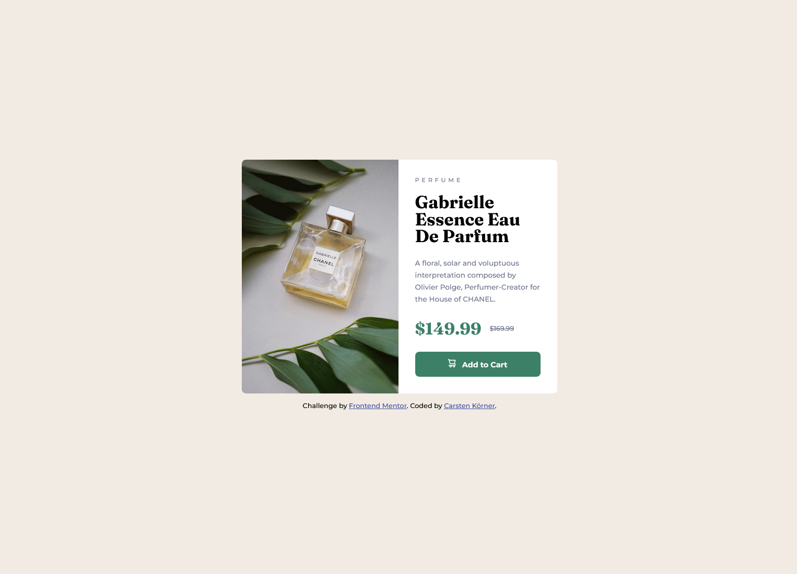

# Frontend Mentor - Product preview card component solution

This is a solution to the [Product preview card component challenge on Frontend Mentor](https://www.frontendmentor.io/challenges/product-preview-card-component-GO7UmttRfa). Frontend Mentor challenges help you improve your coding skills by building realistic projects. 

## Table of contents

- [Overview](#overview)
  - [Screenshot](#screenshot)
  - [Links](#links)
- [My process](#my-process)
  - [Built with](#built-with)
  - [What I learned](#what-i-learned)
  - [Continued development](#continued-development)
- [Author](#author)

### Screenshot

### Links

- Solution URL: [https://www.frontendmentor.io/solutions/responsive-product-preview-card-Q-reYrsjpj](https://www.frontendmentor.io/solutions/responsive-product-preview-card-Q-reYrsjpj)
- Live Site URL: [https://carstenkoerner.github.io/product-preview-card/](https://carstenkoerner.github.io/product-preview-card/)

## My process

### Built with

- Semantic HTML5 markup
- CSS custom properties
- CSS Grid
- scss

### What I learned

I've learned using the html picture element.
And this is the first project I've worked on with scss.

### Continued development

I will continue focusing on scss in future projects. I also want to expand my skills in responsive design.

## Author

- Frontend Mentor - [@carstenkoerner](https://www.frontendmentor.io/profile/carstenkoerner)